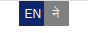

# Introduction

It is the language toggle button that helps to switch the language for the WebApp/Website.



# Installation

```npm install react-language-toggle-button```

# Usage

For use it in your app:

With React Component

```
import './styles.scss';
import LanguageSelector from 'react-language-toggle-button';
function App() {

  return (
    <div className="App">
      <LanguageSelector
        onClickButton1={() => console.log("first button clicked")}
        onClickButton2={() => console.log("Second button clicked")}
        classNameButton1="classButtonName1"
        classNameButton2="classButtonName2"
        classNameSelectedLanguage="classSelectedlanguage"
        buttonName2='ने'
        buttonName1="EN"
      />
    </div>
  );
}

export default App;
```


# Props

Common props you may want to specify include:

* onClickButton1 - function to control the output on clicking first button
* onClickButton2 - function to control the output on clicking second button
* classNameButton1 - Classname to change the css style for the button1
* classNameButton2 - Classname to change the css style for the button2
* classNameSelectedLanguage - Classname to change the css style for selected button
* buttonName1 - Name to be provided for first button
* buttonName2 - Name to be provided for second button


